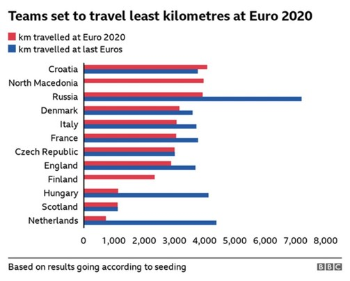

# Programming for Data Science

This repository contains the **Programming for Data Science** project, where key concepts of data exploration, visualization, and time series analysis were applied. The project involved creating polished visualizations, reproducing real-world plots, and analyzing datasets to generate meaningful insights.



---

## Project Overview

The project demonstrates:

- **Time Series Analysis**: Exploring trends and seasonality using a univariate dataset. Key concepts like autocorrelation were analyzed and visualized.
- **Graphical Reproduction**: A real-world visualization from a BBC News article was recreated using Python libraries (`Seaborn`, `Plotly`, and `Matplotlib`).
- **Data Storytelling**: Insights and narratives were developed to effectively communicate findings to decision-makers.

---

## Repository Contents

- **`Programming for Data Science.ipynb`**: The main Jupyter Notebook containing the analysis, code, and visualizations.
- **Visualization Image**: A recreated chart from the BBC News article to showcase data visualization skills.

---

## Key Features

1. **Time Series Plotting**:
   - Loaded and cleaned time series data.
   - Visualized the data to emphasize seasonality and patterns.
   - Implemented autocorrelation analysis.

2. **Graphical Reproduction**:
   - Recreated a bar chart illustrating travel distances for teams during Euro 2020 and the previous Euros.
   - Utilized Seaborn and Plotly libraries for replicating visualizations.

3. **Insights and Storytelling**:
   - Generated insights on travel burdens and team performance in Euro tournaments.
   - Highlighted the importance of balancing logistics in competitive events.

---

## How to Use

1. Clone the repository:
   ```bash
   git clone https://github.com/caspergeorge07/Programming-for-Data-Science.git
   cd Programming-for-Data-Science
